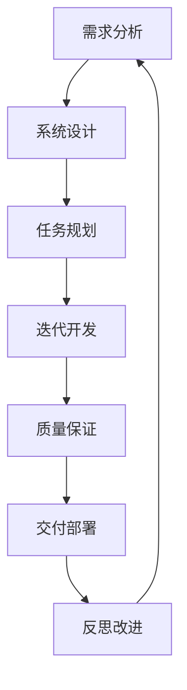

# L3 Streamlit 项目开发指导报告

**生成日期**: 2025-01-19  
**项目版本**: v0.1.0 (Rust/Leptos) / v25.7.17.1542 (Legacy Streamlit)  
**报告目的**: 基于当前内置增强指令，制定有序的软件项目开发策略

---

## 1. 项目现状分析

### 1.1 项目架构状态
- ✅ **双架构并存**: Legacy Streamlit (`/app/`) + 当前 Rust/Leptos (`/src/`)
- ✅ **迁移完成**: 核心功能已从 Python 迁移至 Rust
- ✅ **编译验证**: `cargo check` 通过，依赖解析正常
- ✅ **模块化设计**: 15个核心模块，结构清晰

### 1.2 当前技术栈
- **前端**: Leptos 0.6 (SSR + CSR), WASM
- **后端**: Axum 0.7, Tokio async runtime  
- **数据**: TOML 格式故事数据，Serde 序列化
- **测试**: 单元测试 + 集成测试 + Playwright E2E

### 1.3 项目配置状态
- **Claude Code 集成**: 15个增强指令命令可用
- **权限配置**: 安全的文件和命令权限设置
- **开发工具**: 完整的构建、测试、部署脚本

---

## 2. 内置增强指令体系

### 2.1 核心开发指令

#### **思维分析类**
- `/think-ultra` - 超级综合分析框架，7阶段深度思考
- `/think-harder` - 增强思维分析
- `/reflection` + `/reflection-harder` - 反思和改进机制

#### **项目管理类 (Kiro系列)**
- `/kiro:spec` - 需求规格文档生成
- `/kiro:design` - 系统设计文档创建
- `/kiro:task` - 实施任务清单生成
- `/kiro:execute` - 任务执行管理
- `/kiro:vibe` - 项目氛围和文化

#### **代码开发类**
- `/cc:create-command` - 创建自定义命令
- `/ast-search` - AST代码结构搜索
- `/eureka` - 技术突破文档化

#### **GitHub集成类**
- `/gh:review-pr` - PR审查自动化
- `/gh:fix-issue` - 问题修复流程
- `/setup-gh-aliases` - GitHub别名设置

### 2.2 指令特色功能

1. **系统化流程**: Kiro系列提供从需求到实施的完整工作流
2. **深度思考**: think系列支持复杂问题的多维度分析
3. **知识沉淀**: eureka指令将技术突破转化为可复用资产
4. **品质保证**: 反思机制确保持续改进

---

## 3. 有序软件开发方法论

### 3.1 开发阶段划分



### 3.2 具体开发流程

#### **阶段1: 需求澄清 (Requirements)**
```bash
# 使用 Kiro 需求分析
/kiro:spec [功能名称]
```
- **目标**: 明确功能边界和用户需求
- **输出**: `/docs/specs/{feature}/requirements.md`
- **验收**: 需求文档经过利益相关者审核

#### **阶段2: 系统设计 (Design)**
```bash
# 基于需求生成设计
/kiro:design [功能名称]
```
- **目标**: 技术架构和实现方案设计
- **输出**: `/docs/specs/{feature}/design.md`
- **验收**: 技术方案可行性验证

#### **阶段3: 任务分解 (Planning)**
```bash
# 生成可执行任务清单
/kiro:task [功能名称]
```
- **目标**: 将设计转化为具体编码任务
- **输出**: `/docs/specs/{feature}/tasks.md`
- **验收**: 任务颗粒度适中，可独立完成

#### **阶段4: 迭代开发 (Implementation)**
```bash
# 执行任务
/kiro:execute
```
- **方法**: TDD + 增量开发
- **节奏**: 小步快跑，频繁集成
- **质控**: 每个任务完成后运行测试

#### **阶段5: 深度思考 (Analysis)**
```bash
# 复杂问题分析
/think-ultra [复杂技术问题]
/think-harder [一般技术问题]
```
- **触发**: 遇到技术难题或需要架构决策时
- **目标**: 多维度分析，降低决策风险

#### **阶段6: 质量保证 (Quality)**
```bash
# 代码审查
/gh:review-pr [PR编号]

# 问题修复
/gh:fix-issue [Issue编号]
```
- **自动化测试**: 单元 + 集成 + E2E
- **代码审查**: PR机制 + 自动化检查
- **性能验证**: 基准测试和性能监控

#### **阶段7: 知识沉淀 (Knowledge)**
```bash
# 技术突破记录
/eureka [突破描述]

# 项目反思
/reflection [项目阶段]
/reflection-harder [深度反思]
```
- **文档化**: 将解决方案转化为可复用知识
- **经验总结**: 识别最佳实践和反模式

### 3.3 开发最佳实践

#### **代码质量管控**
1. **编译检查**: 每次提交前运行 `cargo check`
2. **测试驱动**: 先写测试，再写实现
3. **渐进式开发**: 小步提交，频繁集成
4. **性能基准**: 关键路径的性能监控

#### **项目管理原则**
1. **任务原子化**: 每个任务1-4小时完成
2. **依赖管理**: 明确任务间的依赖关系
3. **风险控制**: 提前识别技术风险和缓解策略
4. **进度透明**: 实时更新任务状态

#### **团队协作机制**
1. **文档先行**: 重要决策必须文档化
2. **代码审查**: 所有代码变更经过审查
3. **知识共享**: 技术突破及时分享
4. **持续改进**: 定期回顾和流程优化

---

## 4. L3 Streamlit 项目下一步行动计划

### 4.1 立即行动项 (本周)

1. **编译验证** ✅ 已完成
   - `cargo check` 通过
   - 依赖解析正常
   
2. **功能测试**
   ```bash
   cd /opt/src/streamlit/l3/src
   cargo test
   cargo run
   ```

3. **性能基准测试**
   - 与Legacy版本功能对比
   - 加载时间和内存使用测试

### 4.2 短期目标 (2周内)

1. **UI样式对齐**
   - 匹配Streamlit版本的视觉效果
   - 响应式布局优化

2. **错误处理完善**
   - 故事数据加载异常处理
   - 用户交互错误反馈

3. **生产部署准备**
   - Docker容器化
   - Nginx配置优化

### 4.3 中期规划 (1个月内)

1. **性能优化**
   - WASM包大小优化
   - 首屏加载时间优化

2. **功能增强**
   - 用户会话持久化
   - 多语言支持

3. **监控体系**
   - 错误追踪
   - 性能监控

---

## 5. 开发工具和命令参考

### 5.1 Rust项目命令
```bash
# 项目检查
cargo check

# 运行测试
cargo test

# 开发模式运行
cargo run

# 生产构建
cargo build --release

# 自定义端口运行
LEPTOS_SITE_ADDR="0.0.0.0:18052" cargo run
```

### 5.2 Claude Code增强指令快速参考
```bash
# 需求分析
/kiro:spec [功能名]

# 设计方案
/kiro:design [功能名]

# 任务规划
/kiro:task [功能名]

# 复杂问题分析
/think-ultra [问题描述]

# 技术突破记录
/eureka [突破描述]

# 项目反思
/reflection [反思主题]

# GitHub集成
/gh:review-pr [PR号]
/gh:fix-issue [Issue号]
```

---

## 6. 结论和建议

### 6.1 项目优势
1. **架构现代化**: Rust + Leptos 提供更好的性能和安全性
2. **工具完善**: 丰富的Claude Code增强指令支持高效开发
3. **质量体系**: 完整的测试和代码审查流程

### 6.2 发展建议
1. **保持渐进**: 采用小步快跑的迭代开发模式
2. **文档驱动**: 重要决策和技术突破及时文档化
3. **质量优先**: 不为速度牺牲代码质量和测试覆盖率
4. **持续学习**: 充分利用反思机制持续改进

### 6.3 风险提示
1. **依赖管理**: 关注Rust生态系统版本兼容性
2. **性能监控**: 密切关注WASM包大小和加载性能
3. **用户体验**: 确保迁移后功能和体验不下降

---

**本报告基于当前项目状态和Claude Code增强指令体系生成，为L3 Streamlit项目提供系统化的开发指导。建议定期更新以反映项目进展和工具演进。**